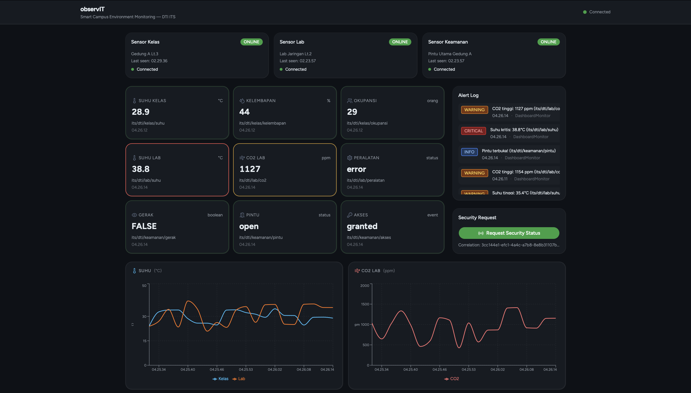

# observIT

Smart Campus Environment Monitoring — DTI ITS


## Dashboard



## Overview

observIT is a Smart Campus Environment Monitoring system built as a university assignment for the "Integrasi Sistem" (Systems Integration) course at Institut Teknologi Sepuluh Nopember (ITS) Surabaya, Indonesia. It simulates an IoT sensor network across DTI (Departemen Teknologi Informasi) campus locations, demonstrating all 10 MQTT 5.0 protocol features without requiring physical hardware.

Three simulated sensor nodes publish environmental data: **SensorKelas** monitors classroom temperature, humidity, and occupancy; **SensorLab** monitors laboratory temperature, CO2 levels, and equipment status; **SensorKeamanan** monitors motion detection, door access, and security events. All data flows through an embedded Aedes MQTT broker to a real-time React dashboard.

The system uses **MQTT 5.0** (via the Aedes embedded broker) as the messaging backbone, with an **Express + Socket.io** bridge connecting the MQTT network to the browser-based **React dashboard**. Alert thresholds are evaluated independently by shared-subscription workers and the dashboard monitor.

## Architecture

```
┌─────────────────────────────────────────────────────┐
│                    observIT System                   │
│                                                     │
│  Publishers              Broker         Subscribers  │
│  ──────────              ──────         ───────────  │
│  SensorKelas ──┐                    ┌── DashboardMonitor │
│  SensorLab   ──┼──► Aedes (1883) ◄──┼── AlertWorker1    │
│  SensorKeamanan┘                    └── AlertWorker2     │
│                                                     │
│  DashboardMonitor ──► Socket.io ──► React Dashboard │
│                         (3000)        (5173 dev)    │
└─────────────────────────────────────────────────────┘
```

| Actor | Role | Topics |
|---|---|---|
| SensorKelas | Classroom environment | `its/dti/kelas/suhu`, `its/dti/kelas/kelembapan`, `its/dti/kelas/okupansi` |
| SensorLab | Laboratory monitor | `its/dti/lab/suhu`, `its/dti/lab/co2`, `its/dti/lab/peralatan` |
| SensorKeamanan | Security & access | `its/dti/keamanan/gerak`, `its/dti/keamanan/pintu`, `its/dti/keamanan/akses` |
| DashboardMonitor | MQTT→Socket.io bridge | `its/dti/#` (wildcard) |
| AlertWorker 1 & 2 | Threshold alerting | `$share/alert-group/its/dti/#` |

## MQTT 5.0 Features

| # | Feature | Implementation | File(s) |
|---|---|---|---|
| 1 | **Publish/Subscribe + QoS** | QoS 0: suhu (fire-and-forget). QoS 1: CO2/kelembapan/okupansi/peralatan/gerak/akses (at least once). QoS 2: door commands (exactly once) | All publishers |
| 2 | **Topic Wildcards** | `its/dti/#` multi-level (DashboardMonitor), `its/dti/+/status` single-level (LWT tracking) | `server.js` |
| 3 | **Topic Alias** | SensorKelas registers alias `1` → `its/dti/kelas/suhu` on first publish, then sends empty topic + alias to reduce overhead | `publishers/sensorKelas.js`, `server.js` |
| 4 | **User Properties** | Every message carries `device-id`, `location`, `unit`, `firmware` metadata in MQTT 5.0 properties | All publishers |
| 5 | **Retain Message** | All publishers set `retain: true` on first publish — new dashboard connections receive last known values immediately | All publishers |
| 6 | **Message Expiry** | CO2 readings expire in 60s (`sensorLab.js`), door commands expire in 30s (`sensorKeamanan.js`) | `publishers/sensorLab.js`, `publishers/sensorKeamanan.js` |
| 7 | **Last Will & Testament** | All publishers register a `will` payload of `{status:"offline"}`. On connect, they publish `{status:"online"}`. Dashboard tracks device health in real time | All publishers, `server.js` |
| 8 | **Request-Response** | Dashboard POST `/api/request-security` → server publishes to `its/dti/keamanan/request` with `responseTopic` + `correlationData` → SensorKeamanan replies → Socket.io emits to browser | `server.js`, `publishers/sensorKeamanan.js` |
| 9 | **Shared Subscription** | AlertWorker1 and AlertWorker2 both subscribe to `$share/alert-group/its/dti/#`. Each message is delivered to only one worker (round-robin load balancing) | `subscribers/alertWorker1.js`, `subscribers/alertWorker2.js` |
| 10 | **Flow Control** | DashboardMonitor connects with `receiveMaximum: 10`, AlertWorkers with `receiveMaximum: 5` to prevent message flooding | `server.js`, `subscribers/` |

## Tech Stack

| Layer | Technology |
|---|---|
| MQTT Broker | Aedes 0.51.x (embedded Node.js broker, patched for MQTT 5.0) |
| MQTT Client | mqtt v5 |
| Backend Bridge | Express + Socket.io |
| Frontend | React + Vite + TypeScript |
| UI Components | shadcn/ui (Radix + Maia preset) |
| Charts | Recharts |
| Runtime | Node.js (CommonJS) |

## Project Structure

```
observIT/
├── broker.js                  # Aedes embedded MQTT broker (port 1883)
├── server.js                  # Express + Socket.io + DashboardMonitor
├── package.json
├── README.md
├── .gitignore
├── .env.example               # Copy to .env before running
├── docs/
│   └── dashboard.png          # Dashboard screenshot
├── patches/                   # Aedes MQTT 5.0 compatibility patches
│   ├── aedes+0.51.3.patch
│   └── aedes-packet+3.0.0.patch
├── common/
│   └── mqttClient.js          # Shared MQTT client factory
├── publishers/
│   ├── sensorKelas.js         # Classroom sensor (Publisher 1)
│   ├── sensorLab.js           # Lab sensor (Publisher 2)
│   └── sensorKeamanan.js      # Security sensor (Publisher 3)
├── subscribers/
│   ├── alertWorker1.js        # Shared subscription worker 1
│   └── alertWorker2.js        # Shared subscription worker 2
└── dashboard/                 # React + Vite monorepo (shadcn/ui)
    ├── apps/web/src/
    │   ├── main.tsx
    │   ├── App.tsx
    │   ├── lib/socket.ts
    │   ├── hooks/useSensorData.ts
    │   └── components/
    │       ├── DeviceStatusPanel.tsx
    │       ├── SensorCard.tsx
    │       ├── LiveChart.tsx
    │       ├── AlertLog.tsx
    │       ├── RequestPanel.tsx
    │       └── theme-provider.tsx
    └── packages/ui/
        ├── src/styles/globals.css
        ├── src/lib/utils.ts
        └── src/components/       # shadcn/ui primitives
            ├── badge.tsx
            ├── button.tsx
            ├── card.tsx
            ├── dialog.tsx
            └── scroll-area.tsx
```

## Prerequisites

```
Node.js >= 18.x
npm >= 9.x
```

No additional software required — broker is embedded.

## Installation & Setup

```bash
# 1. Clone the repository
git clone <your-repo-url>
cd observIT

# 2. Install root dependencies (patches applied automatically via postinstall)
npm install

# 3. Copy environment file
cp .env.example .env

# 4. Install and build dashboard
cd dashboard
npm install
cd apps/web
npm run build
cd ../../..
```

> **Note on Aedes patches:** Aedes 0.51.x does not natively support MQTT 5.0.
> This project includes patches (via `patch-package`) that enable MQTT 5.0
> features including shared subscriptions, topic alias, and user properties.
> Patches are applied automatically on every `npm install` via the
> `postinstall` script — no manual steps needed.

## Running the Project

Eight terminals are required. Start them in order:

```bash
# Terminal 1 — Start MQTT Broker first
npm run broker

# Terminal 2 — Start Express + Socket.io server
npm run server

# Terminal 3 — Dashboard (development mode with HMR)
npm run dashboard
# then open http://localhost:5173
# OR open http://localhost:3000 for production build (after npm run build)

# Terminal 4 — Classroom sensor publisher
npm run pub:kelas

# Terminal 5 — Lab sensor publisher
npm run pub:lab

# Terminal 6 — Security sensor publisher
npm run pub:keamanan

# Terminal 7 — Alert worker 1
npm run sub:alert1

# Terminal 8 — Alert worker 2
npm run sub:alert2
```

> **Startup order matters.** Always start the broker (Terminal 1) before anything else. Start the server (Terminal 2) before opening the dashboard.

## Available npm Scripts

| Script | Description |
|---|---|
| `npm run broker` | Start Aedes MQTT broker on port 1883 |
| `npm run server` | Start Express + Socket.io bridge on port 3000 |
| `npm run pub:kelas` | Start classroom sensor publisher |
| `npm run pub:lab` | Start lab sensor publisher |
| `npm run pub:keamanan` | Start security sensor publisher |
| `npm run sub:alert1` | Start shared subscription alert worker 1 |
| `npm run sub:alert2` | Start shared subscription alert worker 2 |
| `npm run dashboard` | Start React dashboard (Vite dev server, port 5173) |

## Alert Thresholds

| Sensor | Metric | Warning | Critical |
|---|---|---|---|
| SensorKelas / SensorLab | Suhu (°C) | > 35°C | > 38°C |
| SensorLab | CO2 (ppm) | > 1000 ppm | > 1200 ppm |
| SensorKeamanan | Gerak | Motion detected | — |
| SensorKeamanan | Pintu | Door open | — |

## Dashboard Features

- **Device Status Panel** — Real-time online/offline status for all 3 sensors (driven by LWT)
- **Sensor Grid** — Latest readings for all 9 data points with units and timestamps
- **Live Chart** — Rolling time-series chart showing Suhu Kelas, Suhu Lab, and CO2 Lab (last 20 points)
- **Alert Log** — Last 10 alerts with severity badge (WARNING / CRITICAL) and timestamp
- **Security Request Panel** — On-demand request to SensorKeamanan using MQTT Request-Response pattern

## Implementation Notes

### Aedes MQTT 5.0 Compatibility

Aedes 0.51.x was designed for MQTT 3.1.1. To support the MQTT 5.0 features required by this assignment, the following broker files were patched using `patch-package`:

- `aedes/lib/handlers/connect.js` — Accept protocol version 5, CONNACK properties
- `aedes/lib/handlers/publish.js` — Topic alias resolution, MQTT 5.0 PubAck
- `aedes/lib/handlers/subscribe.js` — Shared subscription (`$share/`) support
- `aedes/lib/write.js` — Forward protocol version to packet encoder
- `aedes-packet/packet.js` — Preserve MQTT 5.0 properties during packet forwarding

### Topic Alias Client-Side Resolution

Because Aedes may not always forward resolved topic names to subscribers, `server.js` maintains a local `topicAliasMap` to resolve alias integers back to full topic strings independently of broker behavior.